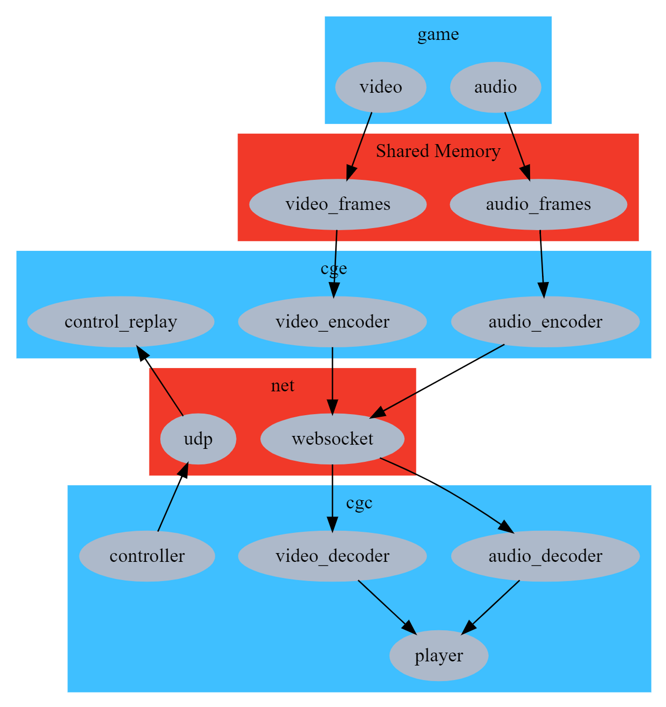
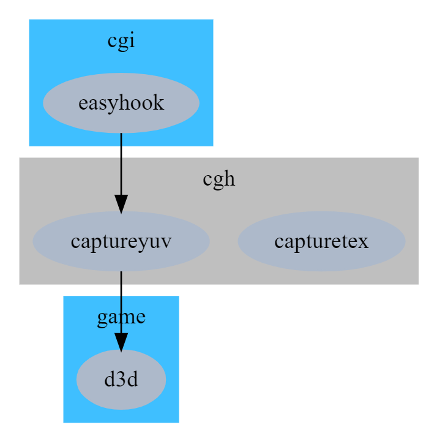
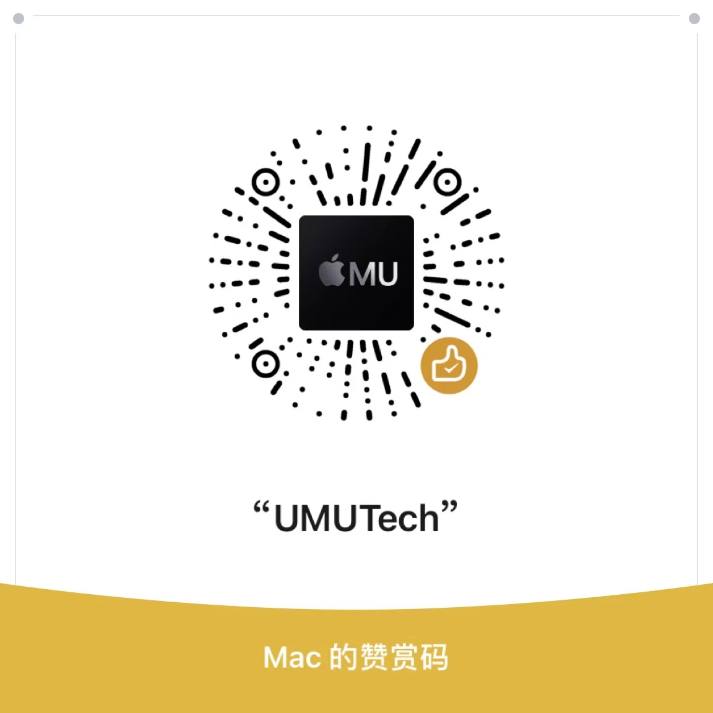

# Regame - Cloud Gaming Engine

[简体中文](README.zh-CN.md) | English

`Regame - Cloud Gaming Engine` is a set of technologies developed by Edge computing team of [Ksyun](https://www.ksyun.com/) to serve the cloud game scene.

Cloud gaming is a method of playing video games that is done using remote hardware. You don't have to download or install games locally, just begin playing the game immediately because it is being run on remote servers. 

Cloud gaming engine is a core technology to host ordinary games on remote server and start cloud gaming service.

`Regame` is still under development. It would be great if you could help.

Demo videos (Chinese):

- [Regame Cloud Gaming Demo - Street Fighter](https://www.bilibili.com/video/bv1jt4y1r7GT) - bilibili

- [Regame Cloud Gaming Demo - Street Fighter](https://www.ixigua.com/6898563893564703239) - ixigua

- [Regame Cloud Gaming Demo - Street Fighter](https://www.zhihu.com/zvideo/1314567244832530432) - zhihu

## 1. Requirements

### Server

| Target | Minimum | Recommended |
| --- | --- | --- |
| System | Windows 7, 8, 8.1, 10 | Windows 10 |
| GPU | NVIDIA GPU | RTX 1080Ti, GTX 2070S tested |
| Software | GeForce Experience | latest GeForce Experience |
| Driver | GeForce Game Ready Driver | latest GeForce Game Ready Driver |

* If you don't have an NVIDIA GPU, select --enable-nvenc=false to run `cge`.

### Client

| Target | Minimum | Recommended |
| --- | --- | --- |
| System | Windows 7, 8, 8.1, 10 | Windows 10 |
| CPU | ANY | amd64 |

## 2. Basic

Use Hook technology to capture image, support most of DirectX games, such as Cyberpunk 2077, Street Fighter.

[](doc/cg.gv)

## 3. QuickStart

All the componets listed below, will be open source by time.

### cge

The `Cloud Gaming Engine`.

You can launch `cge` directly, which will apply the following options:

```
audio-bitrate: 128000
audio-codec: libopus
bind-address: ::
control-port: 8080
donot-present: false
enable-nvenc: true
keyboard-replay: none
gamepad-replay: none
stream-port: 8080
video-bitrate: 1000000
video-codec: h264
video-gop: 180
video-preset: llhp
video-quality: 23
```

Run `cge --help` to see all options:

```
Usage:
  -h [ --help ]                  produce help message
  --audio-bitrate arg (=128000)  set audio bitrate
  --audio-codec arg (=libopus)   set audio codec, can be one of {libopus, opus,
                                 aac}
  --bind-address arg (=::)       set bind address for listening, eg: 0.0.0.0
  --control-port arg (=8080)     set the UDP port for control flow
  --donot-present arg (=0)       Tell cgh don't present
  --enable-nvenc arg (=1)        Enable nvenc
  --keyboard-replay arg (=none)  keyboard replay method, can be one of {none,
                                 cgvhid}
  --gamepad-replay arg (=none)   gamepad replay method, can be one of {none,
                                 cgvhid, vigem}
  --stream-port arg (=8080)      set the websocket port for streaming, if port
                                 is 0, disable stream out via network. Capture
                                 and encode picture directly at startup but not
                                 on connection establishing, and never stop
                                 this until cge exit. stream port is not same
                                 as control port, this port is only for media
                                 output.
  --video-bitrate arg (=1000000) set video bitrate
  --video-codec arg (=h264)      set video codec, can be one of {h264, h265,
                                 hevc}, h265 == hevc
  --video-gop arg (=180)         set video gop
  --video-preset arg
  --video-quality arg (=23)      set video quality, lower is better, available
                                 range is 0-51, 0 is lossless
```

You can press `Ctrl+C` to stop it gracefully.

### cgh

Some hook dlls for capturing pictures from D3D game.

### cgi

A tool for injecting hook dll into game process.

[](doc/cgi.gv)

```
Allowed options:
  -h [ --help ]              Produce help message
  -d [ --dynamic ] arg       Use dynamic injecting
  -e [ --exec ] arg          Path of the executable
  -a [ --arg ] arg           Arguments of the executable
  -c [ --cd ] arg            Current directory for the executable
  -i [ --imagename ] arg     Image name of the process being injected.
  -w [ --wait ] arg (=1,000) Wait before injecting. unit: ms
  --lx86 arg                 Path of x86 library path
  --lx64 arg                 Path of x64 library path
```

### cgvhid

Cloud gameing Virtual HID driver. For replaying controller event on server.


### cgvidd

Cloud gameing Virtual Indirect Display Driver. For capturing screen on server.

### video_source

A tool for testing. Just run it, and it will generate simple pictures and write them as video frames to shared memory, then notify `cge` to fetch. You can use `cgc` to see these pictures.

### cgc

A testing version client to work with `cge`. Download h264 version [here](https://ks3-cn-beijing.ksyun.com/liuguang/cgc.7z) and h265 version [here](https://ks3-cn-beijing.ksyun.com/liuguang/cgc-h265.7z).

```
Usage:
  --server (=127.0.0.1) set server address
  --port (=8080)        set server port
  --hw_decode           hardware decoder, only support d3d11va now.
```

### cgs

A WebRTC server works together with `cge`, to serve web clients.

## 4. Setting Up Your Build Environment

### 4.1 VS2019

Install VS2019 with ATL, CLang.

[CLang/LLVM x64](https://github.com/llvm/llvm-project/releases/download/llvmorg-11.0.0/LLVM-11.0.0-win64.exe) is also needed, while VS may only has CLang x86.

### 4.2 Boost

Install [Boost](https://www.boost.org/) and set `BOOST_ROOT` environment variable to install directory. [Details](https://blog.umu618.com/2020/09/11/umutech-boost-1-installation/)

Boost compile command:

```
# For MTRelease configuration
.\b2 --address-model=64 runtime-link=static
```

### 4.3 FFmpeg

Set `FFMPEG_ROOT` environment variable to the path of your [FFmpeg](https://www.ffmpeg.org/download.html) directory. 

The folder tree should be like:

```
├─bin
├─include
│  ├─libavcodec
│  ├─libavdevice
│  ├─libavfilter
│  ├─libavformat
│  ├─libavutil
│  ├─libpostproc
│  ├─libswresample
│  └─libswscale
└─lib
    ├─x64
    └─x86
```

Video Reference (Chinese):

- [Regame Cloud Gaming Engine FAQ: FFmpeg configuration](https://www.bilibili.com/video/BV1Dh41127xo/) - bilibili

- [Regame Cloud Gaming Engine FAQ: FFmpeg configuration](https://www.ixigua.com/6917303228136849933) - ixigua

### 4.4 SDL

Set `SDL2_ROOT` environment variable to the path of your [SDL2](https://www.libsdl.org/) directory. eg:

The same as [SDL_ttf 2.0](https://www.libsdl.org/projects/SDL_ttf/) and [SDL_net 2.0](https://www.libsdl.org/projects/SDL_net/).

The folder tree should be like:

```
├─bin
├─include
│  └─SDL2
└─lib
    ├─x64
    └─x86
```

### 4.5 WDK

Required by cgvhid, cgvidd.

## 5. Building and Testing

```
git clone https://github.com/ksyun-kenc/liuguang
cd liuguang
git submodule update --init
```

Open each solution file with VS, prefer to select MTRelease configuration, then build.

Test steps:

- Run `cge` on server.

- Run `video_source` on server.

- Run `cgc --server=<server_address>` on anther PC as long as it can access the server over the network.

Test with games:

Assume you want to test USF4.

- Install `cgvhid` on server. [Details](src/cgvhid/cgvhid/)

- If you prefer gamepad to keyboard, install `ViGEmBus` on server. [Download](https://github.com/ViGEm/ViGEmBus/releases)

- Run `cge --keyboard-replay=cgvhid --gamepad-replay=vigem` on server.

- Run `cgi -d true -e SSFIV.exe -i SSFIV.exe --lx86 .\captureyuv.dll` on server.

- Run `cgc --server=<server_address>` on anther PC as long as it can access the server over the network.

**Note** that only support D3D9, D3D11, D3D12 games now.

Video Reference (Chinese):

- [Regame Cloud Gaming Engine Test Steps](https://www.bilibili.com/video/BV17T4y1N7bk/) - bilibili

- [Regame Cloud Gaming Engine Test Steps](https://www.ixigua.com/6909415761098310158) - ixigua

- [Regame Cloud Gaming Engine Test Steps](https://www.zhihu.com/zvideo/1325164569828806656) - zhihu

## 6. Contact Us

WeChat: UMUTech

## 7. Buy Me a Coffee?


